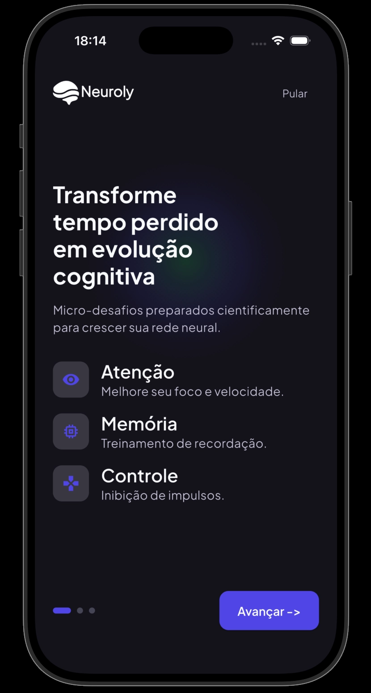
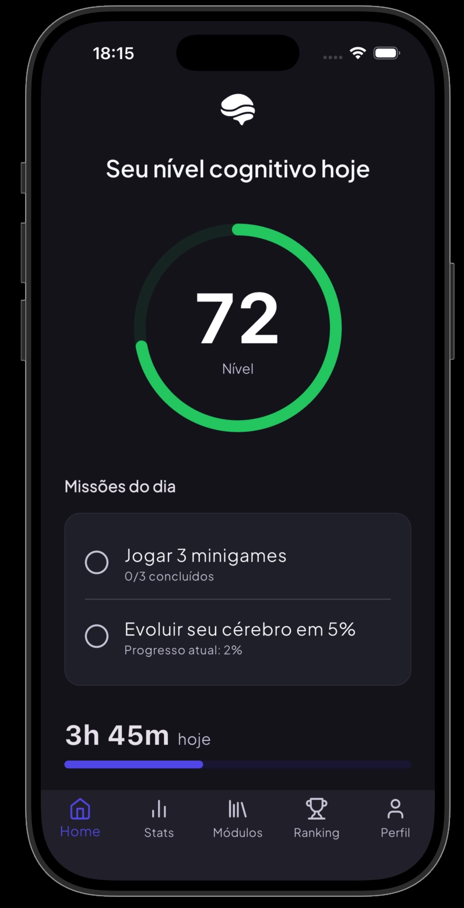
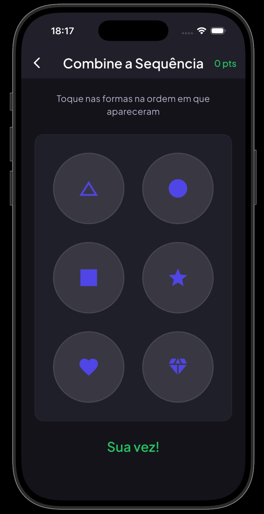

<div align="center">
  

  # Neuroly - Cognitive Evolution Hub 

  <p align="center">
    Uma plataforma gamificada projetada para aprimorar as funções cognitivas através de mini-jogos diários. Uma experiência <i>Cyber-Cognitive</i> premium, imersiva e visualmente sofisticada.
  </p>

  <p align="center">
    
    
    
  </p>
</div>

---

##  Galeria do Projeto

<div align="center">
  
  
  
</div>

---

##  Objetivo do Projeto
O **Neuroly** foi idealizado para ser muito mais que um aplicativo: é um hub de evolução mental. Através da repetição de testes de memória, atenção e agilidade, ele busca monitorar o desenvolvimento da cognição do usuário de forma leve e instigante.

Nosso diferencial é o **Design**. Utilizamos a estética **Glassmorphism**, com animações super detalhistas ("Staggered Animations"), ícones minimalistas e navegação global fluida com transições cinematográficas (`Slide + Fade`).

---

##  Arquitetura e Estrutura

O código segue o modelo **Feature-First** (Clean Architecture), o que facilita a escalabilidade, permitindo que a equipe escale novas features de maneira rápida e segura.

* **`/core/`**: Onde definimos os blocos de construção globais (`theme/app_colors.dart`, `widgets/glass_container.dart`).
* **`/features/`**: Onde vivem os contextos do negócio:
  * 🎲 `game/` (Memória, Atenção, Sequência)
  * 🏠 `home/` (Dashboard Principal)
  * 📊 `stats/` (Evolução Cognitiva)
  * 📚 `modules/` (Biblioteca de treinos)
  * 🏆 `ranking/` (Leaderboard Nacional)
  * 👤 `profile/` (Dados do usuário)

> Para detalhes completos sobre as páginas e cores (`#4F46E5`, `#22C55E`), leia o [Documento de Overview do Projeto](docs/PROJECT_OVERVIEW.md).

---

##  Tecnologias Utilizadas

* **[Flutter](https://flutter.dev/)** (Framework Multiplataforma)
* **[Dart](https://dart.dev/)** (Linguagem base)
* **[flutter_animate](https://pub.dev/packages/flutter_animate)** (Animações declarativas super fluidas)
* **[lucide_icons](https://pub.dev/packages/lucide_icons)** & **[cupertino_icons](https://pub.dev/packages/cupertino_icons)** (Design System moderno)
* **[google_fonts](https://pub.dev/packages/google_fonts)** (Tipografia)
* **[flutter_launcher_icons](https://pub.dev/packages/flutter_launcher_icons)** (Gerenciamento cross-platform de ícones)

---

##  Como Executar Localmente

Você precisará do [Flutter instalado](https://docs.flutter.dev/get-started/install) e configurado na sua máquina.

1. **Clone o Repositório:**
```bash
git clone https://github.com/LucasAlberto0/Neuroly.git
cd Neuroly
```

2. **Instale as dependências:**
```bash
flutter pub get
```

3. **Inicie o Aplicativo (Web/Simulador):**
```bash
flutter run -d chrome
```

---

## 🗺 Próximos Passos (Roadmap)
- [x] Construção da identidade visual (Design System).
- [x] Estruturação base de navegação e telas de controle.
- [x] Lógica base dos Mini-Jogos (Memória, Atenção, Sequência).
- [ ] Integração com Backend (Supabase/Firebase) para Ranking Nacional Real.
- [ ] Implementar Hive ou SharedPreferences para salvar o estado offline do usuário.
- [ ] Gráficos dinâmicos de Score cruzado na tela de Stats.

---
<div align="center">
  <sub>Construído com muito café ☕ e animações de 60 FPS por Lucas.</sub>
</div>
